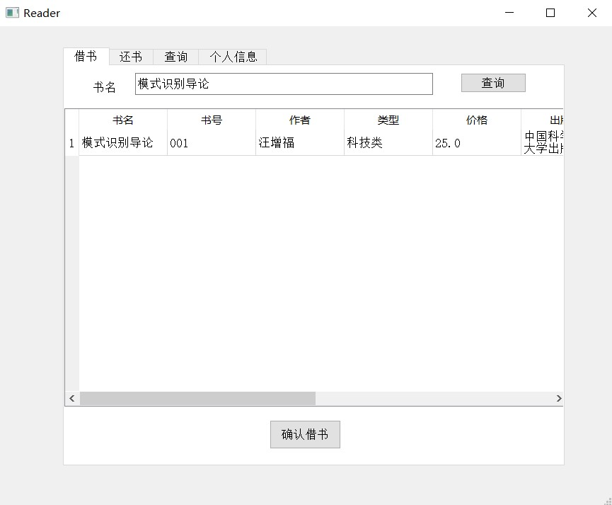
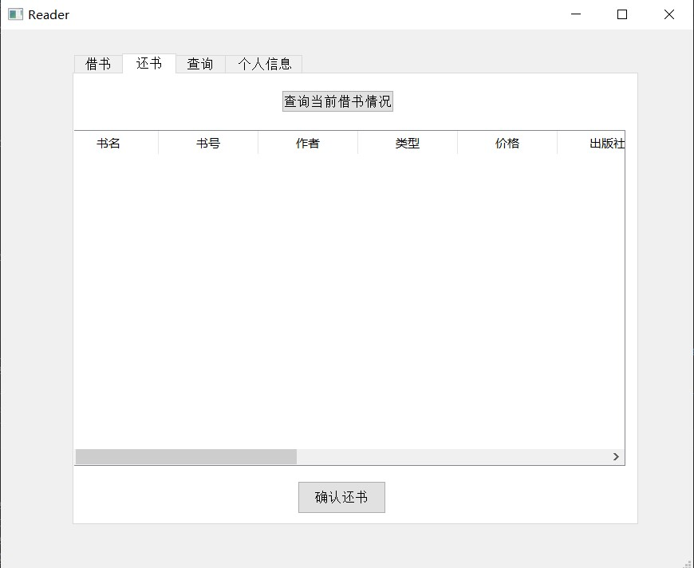

中国科学技术大学计算机学院

《数据库系统实验报告》

  
    

实验题目：图书馆管理系统数据库设计开发

学生姓名：赵卓

学生学号：PB21111686

完成时间：2024年6月18日

## 需求分析
- 为了实现图书馆管理系统数据库，我们从实体属性和过程规定进行需求分析：
  - 各实体属性如下：
    - 借阅者有读者号、姓名、系别、可借册数、在借册数、密码、欠款、个人照片，其中读者号唯一标识一个借阅者。
    - 管理员有管理号、姓名、性别、手机号、密码，其中管理号唯一标识一个管理员。
    - 图书有书号、书名、作者、类型、位置、价格、出版社、在馆册数、馆藏册数、被借次数，其中书号唯一标识一本图书，在馆册数大于等于馆藏册数。
    - 读者可借阅图书，借阅时应该记录下借书时间、应还日期（规定每个读者可以借书一个月，因此应还日期为借书时间加一个月）、归还日期（默认为空）、是否逾期（默认为否）、是否归还（默认为否），在读者还书时，更新归还日期、是否逾期、是否归还。
  - 对于借书和还书过程规定如下：
    - 管理员可以管理图书，可以对图书进行增加、删除、修改操作。
    - 当一本书被借走时，在馆册数减一，被借次数加一；当一本书被归还时，在馆册数加一。
    - 当一个借阅者借走一本书后，可借册数减一，在借册数加一；当读者还书时，根据还书日期是否超过应还日期更新欠费，每逾期一本书则欠费加10。
    - 对于每本图书，如果读者符合借阅条件则可以直接借阅不需要审批（这也是符合现实的），如果借阅某本图书还未归还则不允许再次借阅（防止一人独占资源）。
    - 如果管理员误删除了某本图书，那么借阅表中相关信息也会被删除。
 

## 总体设计
#### 系统模块结构
- 本系统采用C/S架构。前端使用PyQt Designer设计，生成UI的Python代码，后端数据库采用MySQL实现。前端通过Python的connect库与后端数据库连接，并且将前端的信号槽与后端的查询、存储过程、事务、函数等相连，点击相关信号槽则在后端中调用相关语句。
- 前端：总共设计了五个UI界面：login界面（初始登入界面，可以进行登录或者跳转到注册界面）、manager_register界面（管理员注册界面）、reader_register界面（借阅者注册界面）、reader界面（借阅者操作界面）、manager界面（管理员操作界面）。通过执行main.py文件连接数据库进入login界面，点击信号槽进入其他界面。
- 后端：根据需求分析得到四个基本表：readers、books、workers、borrow，以及满足还书借书过程的部分触发器、函数、存储过程、事务。
- 下图为前后端各模块以及连接示意图：
  
 

#### 系统工作流程
- 系统工作流程：执行命令行指令python ./main.py，会出现初始UI界面（即login）。点击借阅者注册或者管理员注册就会出现借阅者注册UI或者管理员注册UI，输入相关信息并提示注册成功后，表明在后端数据库的相关表中已经插入注册内容然后重新输入命令行启动程序。注册完毕后输入信息登录，经过后端数据库验证ID和密码对应正确，如果是管理员，系统会跳转到管理员界面；如果是借阅者，系统会跳转到借阅者界面。用户在相关页面进行操作查询、插入、删除、修改时，在后端数据库进行对应改变。
- 工作流程图如下：
  
 

#### 数据库设计
- 根据需求分析，设计ER图如下：
  
- 模式分解之后得到如下基本表：
  - books（书号，书名，作者，类型，价格，出版社，馆藏册数，在馆册数，馆藏册数，位置，被借次数），书号是唯一主码。
  - readers（读者号，姓名，性别，系别，可借册数，在借册数，密码，欠款，个人照片），读者号是唯一主码。
  - workers（管理号，姓名，性别，手机号，密码），管理号是唯一主码。 
  - borrow（读者号，书号，借书时间，应还日期，归还日期，是否归还，是否逾期，事务编号），通过事务编号标识每个borrow事务。
 

## 前后端代码实现
#### 仓库地址
- https://github.com/YeMoBingYu/2024_USTC_Database_Library
 

#### 目录
- ├── connect.py---前后端链接文件         
  ├── create.sql---数据库基本表、触发器、存储过程、函数创建
  ├── login.py---登入界面
  ├── main.py---主文件
  ├── manager.py---管理员界面
  ├── manager_register.py---管理员注册界面
  ├── reader.py---读者界面
  └── reader_register.py---读者注册界面
 

#### 数据库基本表建立（后端）
- 以readers为例，根据ER图得到的readers，将readers的各属性加入表中，为了能展示中文，设置utf8mb4编码，为了展示图片，用mediumblob存储图片。其他表类似，代码如下：
  
 

#### 触发器建立（后端）
- 根据需求分析，数据库中有几个触发器要实现：当读者借书之后，书的被借次数加一，在馆册数减一；当读者借书之后，读者的可借册数减一，在借册数加一；当读者还书之后，书的在馆册数加一，读者的可借册数加一，在借册数减一；当读者还书之后，根据当前日期是否逾期更新读者的欠费。为了避免过多触发器，本次实验只建立了一个触发器：建立在books表上，根据borrow的插入，更新相同书号的图书的被借次数和在馆册数，其他触发器通过存储过程实现，代码如下：
   
 

#### 函数建立（后端）
- 为了实现文件（照片）管理，建立了setimg函数，通过输入的文件路径，用blob类型数据存储文件路径读出的内容，并将其插入readers表中，可以直接调用函数进行readers表插入，代码如下：
   
 

#### 前后端链接
- 前后端链接可通过python中pymysql库中的connect函数实现，链接成功则返回一个代表后端数据库的conn以及一个执行sql语句的游标conn.cursor，这样我们可以在前端中用字符串变量存储sql语句，通过cursor在后端执行并返回结果，然后通过conn提交，从而通过python代码实现sql语句执行。链接代码如下：
   
 

#### 前端UI的实现（前端）
- 多亏了pyqt5库和pyqt5 designer的存在，我们可以通过拖拽组件构建自己想要的页面ui代码，然后直接转成Python代码实现前端页面。本次实验共有五个UI，都是通过pyqt5 designer实现的，非常方便，比如reader的UI在pyqt5 designer中的设计：

 

#### 信号槽的连接（前端）
- 在设计了前端UI之后，我们希望通过点击前端界面中的某个按键就能实现对应的功能，即对数据库进行操作。比如我们希望管理员通过点击增加按键就能在数据库books表中增加输入的图书信息并将其显示在页面中，这就需要进行信号槽连接。简单来说，信号槽链接就是将按键和某个函数关联起来，当点击这个按键时，就调用对应函数。这样我们可以在Python文件中编写好对应功能的函数，将其和对应信号槽链接即可。以管理员界面为例，pushButton是管理员ui中读者条件查询按钮的名称，函数selectreader是条件查询读者的函数，因此将这两者链接起来，以此类推，代码如下：
  
 

#### 前端功能函数的实现（前端）
- 由于我们的输入的信息（比如输入的书籍信息）在前端，为了方便地根据这些信息进行正确的存储过程调用，我们需要在前端的Python代码通过前后端链接的cursor在后端数据库中执行我们根据输入信息在前端编写的sql语句，然后根据返回结果在前端中显示正确结果。
- 以读者的借书功能为例：
  - 首先读者要选中一本书，self.tableWidget.currentRow()是读者在当前表格中选中的行数，self.tableWidget是designer中的一个组件，如果行数等于-1，说明读者没选中，那么发出提示信息“请选中想借的书”。
  - 当读者选中书之后，要对读者是否可以借这本书进行判断，如果读者借书次数不够或者这本书的数目小于1或者读者已经借了这本书但是还没有归还，都不能借书。因此我们需要根据这三个条件依次判断：
     - 首先编写sql语句'select * from readers where 读者号="%s"' ，其中%s被self.readerid即读者号替换，通过cursor执行，返回读者的所有信息，并通过fetchall()将结果取出存在readers中，第一个读者readers[0]就是我们要找的读者reader，然后判断其借书次数即reader[4]是否小于1，小于1则发出提示信息“借书次数不够”。
     - 然后判断书在馆册数是否大于1，在馆册数是self.tableWidget.item(chooserow,7).text()，这是读者选中行的第8个元素，根据表格顺序可知就是在馆册数。
     - 然后判断是否在借未还，我们要在borrow表中根据读者id，书id和是否归还三个条件查找，如果返回结果不为空则说明在借未还，即执行sql语句'select * from borrow where 读者号="%s" and 书号="%s" and 是否归还="否"'，其中两个%s分别被self.readerid和bookid即读者号和书号替换。
  - 如果三个条件都满足，则可以借书：
    - 首先将借书信息插入borrow表，执行sql语句'insert into borrow(读者号,书号,借书时间,应还日期) values ("%s","%s","%s","%s")'，其中四个%s分别被self.readerid，bookid，date_now，newdate替换。
    - 除此之外，还需要实现没有在后端中实现的触发器功能，即更新readers表的在借册数和可借册数，通过执行sql语句'update readers set 可借册数=可借册数-1, 在借册数=在借册数+1 where 读者号="%s"'，其中%s被self.readerid替换。
  - 执行完毕之后通过conn进行commit提交即可。
  
 - 以此类推，我们可以实现各个对应按钮需要的函数，在前端中调用后端执行sql语句。
 

## 实验与测试
#### 依赖
- 依赖python中pymysql、pyqt5、time、datetime、dateutil.relativedelta、sys、io、PIL库。
 

#### 部署
- 输入指令python ./main.py即可。
 

#### 实验结果
- 输入指令后界面如下：
  
  注册管理员：
  
  
  注册借阅者，输入个人照片地址：
  
  
  管理员登录后个人信息展示如下：
  
  修改后再次查询：
  
  
  管理员对书籍进行管理，依次增加模式识别导论、机器学习、数据库系统三本书：
  
  
  
  选中第一本并修改价格：
  
  
  选中第三本并删除：
  
  
  管理员查询读者信息：
  
  用户登录查询个人信息，包括个人照片：
  
  修改个人信息之后：
  
  
  读者查询图书信息：
  
  读者根据书名查询图书并借阅：
  
  
  此时在还书页面查询当前借书情况：
  
  
  并且个人信息中在借数目加一，可借数目减一：
  
  再查询图书信息，在馆册数减一，被借册数加一：
  
  再还书，还书后当前借书情况为空：
  
  
  还书后，再查询图书，发现在馆册数加一：
  
  再查询个人信息，发现在借册数减一，可借册数加一：
  
  让读者再次借刚刚那本书，然后管理员登入将这本书删除：
  
  回到读者页面，发现当前借书情况中那本书的记录也被删除：
  
- 上面演示了一个完整的读者管理员注册、管理员增删查改图书、读者查询图书借阅图书并归还图书的过程，同时还展示了级联删除，当管理员删除图书信息时，读者的借阅信息中相关内容也会被删除。也展示了对文件（图片）的管理，每个读者都有属于自己的个人照片，这里展示使用的是一朵花。综上所述，本次实验实现了合理的图书馆数据库管理系统，可以完成符合实际和需求的管理操作。
 

## 参考
- 前端未使用模版，使用pyqt5 Designer设计，生成py文件。
- 图片为数字图像处理实验使用照片：
  
- 各库官网：
  - pymysql：https://github.com/PyMySQL/PyMySQL
  - pyqt5：https://www.riverbankcomputing.com/software/pyqt/intro
  - time、datetime：https://docs.python.org/zh-cn/3/
  - dateutil.relativedelta：https://dateutil.readthedocs.io/en/stable/
  - sys、io：python官网
  - PIL：https://pillow.readthedocs.io/en/stable/